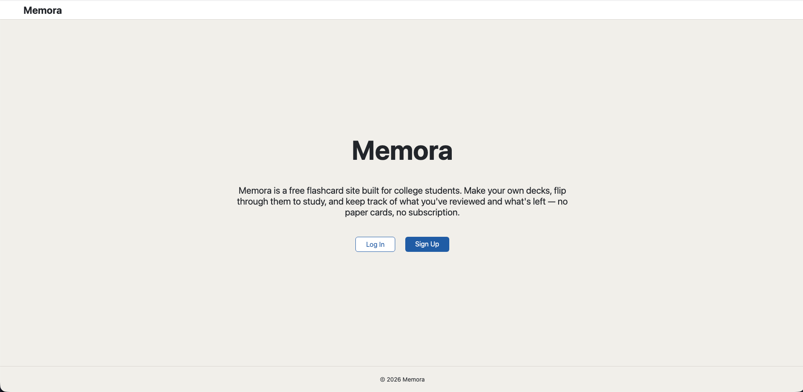
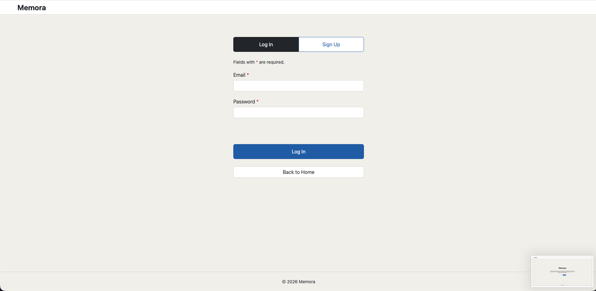
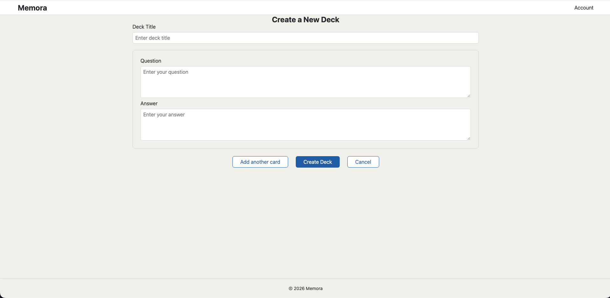
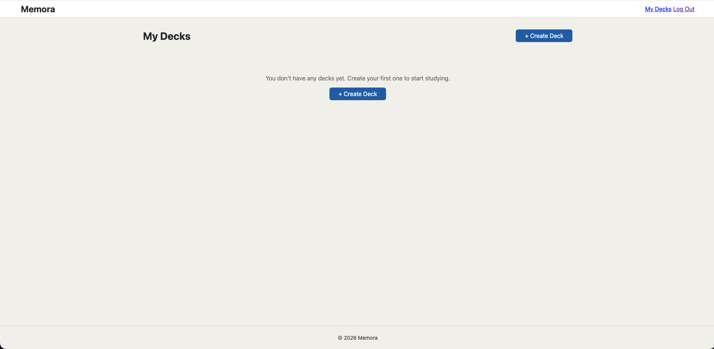
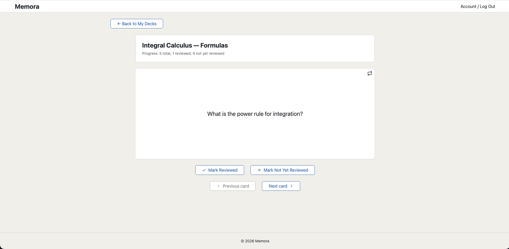

# Memora

A free flashcard web app for college students.

## 1. Overview

Memora is a free flashcard web app for college students who want a faster way to review than paper cards. Students can create their own decks, study them with a flip-card interface, and see how many cards they still need to review, all without a paid subscription.

## 2. How to view it

**Live site:** https://joshphilippuangco.github.io/Memora/

**To run it locally:** clone the repository, then open `index.html` directly in a browser. No build step or local server is needed, since the site is plain HTML, CSS, and JavaScript.

```
git clone https://github.com/JoshPhilipPuangco/Memora.git
```

## 3. Pages and features

| Page                                 | What it does                                                                                                                                                                                                                                  | Navigation                                                                                                       | JavaScript                                                                                                                                                                                                                                                           |
| ------------------------------------ | --------------------------------------------------------------------------------------------------------------------------------------------------------------------------------------------------------------------------------------------- | ---------------------------------------------------------------------------------------------------------------- | -------------------------------------------------------------------------------------------------------------------------------------------------------------------------------------------------------------------------------------------------------------------- |
| **Home** (`index.html`)              | Intro to Memora with Log In / Sign Up buttons and a footer.                                                                                                                                                                                   | Links to Log In / Sign Up.                                                                                       | None.                                                                                                                                                                                                                                                                |
| **Log In / Sign Up** (`login.html`)  | One page with a Login tab and a Signup tab. Switching tabs shows the matching form. Fields are validated before saving (username 6+ characters, valid email format, password 6+ characters).                                                  | On success, the user is sent to My Decks (see Known Issues #1). The logo or "Back to Home" link returns to Home. | `login.js` handles tab switching, field validation, and saves the account and current user to `localStorage` (there is no real backend yet).                                                                                                                         |
| **My Decks** (`mydecks.html`)        | Shows the student's decks as cards, each with its title, card count, and last studied date, plus a progress summary. A "Create new deck" button and a modal let a student create, rename, or delete decks.                                    | "Study" on a deck card opens Study Mode. "Create new deck" opens Create Deck.                                    | `mydecks.js` renders the decks from `localStorage`, handles the create/rename/delete modal, and re-renders the page after every change.                                                                                                                              |
| **Create Deck** (`create-deck.html`) | Lets a student name a new deck and add question/answer card fields, with buttons to add or remove individual cards before saving.                                                                                                             | "Cancel" returns to the previous page. Saving is meant to return to My Decks (see Known Issues #4 and #5).       | `create-deck.js` dynamically adds and removes card fields, each with a unique ID.                                                                                                                                                                                    |
| **Study Mode** (`study.html`)        | Shows one deck's cards one at a time: a title with a progress summary, a flip card that shows the question first and flips to the answer on click, and buttons to mark a card reviewed or not reviewed and move to the next or previous card. | "Back" or "Exit" returns to My Decks.                                                                            | An inline `<script>` block at the bottom of `study.html`, instead of a separate `.js` file. It loads the sample deck and renders the flip card, but currently always shows the same hardcoded deck rather than reading which deck was clicked (see Known Issues #6). |

## 4. Project structure

```
Memora/
├── index.html, login.html, create-deck.html, mydecks.html, study.html
├── shared.css (site-wide styles) + one CSS file per page
├── login.js, create-deck.js, mydecks.js (one JS file per interactive page)
├── style.css, script.js (unused repo template leftovers)
├── assets/screenshots/ (README screenshots)
└── .github/ (CODEOWNERS + GitHub Pages deploy workflow)
```

Each page loads `shared.css` plus its own page-specific CSS file. `style.css` and `script.js` are confirmed leftovers from the repo template. Neither is linked from any page and neither will be used going forward.

## 5. Screenshots

| Page             | Screenshot                                                     |
| ---------------- | -------------------------------------------------------------- |
| Home             |                  |
| Log In / Sign Up |  |
| Create Deck      |    |
| My Decks         |          |
| Study Mode       |      |

## 6. Known issues and next steps

| #   | Issue                                                                                                                          | Next step                                                                                              |
| --- | ------------------------------------------------------------------------------------------------------------------------------ | ------------------------------------------------------------------------------------------------------ |
| 1   | Login and signup send the user to `my-decks.html`, but the real file is named `mydecks.html`.                                  | Fix the filename in `login.js` so it points to `mydecks.html`.                                         |
| 2   | The My Decks logo link points to `my-decks.html` instead of `mydecks.html`.                                                    | Fix the href in `mydecks.html`.                                                                        |
| 3   | `mydecks.html` loads a `shared.js` file that doesn't exist.                                                                    | Either add the missing file or remove the `<script>` tag.                                              |
| 4   | The Create Deck form doesn't save anything. Submitting it only calls `event.preventDefault()`.                                 | Wire up the submit handler to actually store the deck title and its cards.                             |
| 5   | My Decks and Create Deck use two disconnected "create a deck" systems, so no deck a user creates ever ends up with real cards. | Merge the two flows into one, so saving a deck on either page produces a deck that actually has cards. |
| 6   | The Study page always shows the same hardcoded deck, no matter which deck's "Study" button was clicked.                        | Read the `?deck=` ID from the URL and load that specific deck from `localStorage`.                     |
| 7   | The "Account / Log Out" link is just `href="#"` and does nothing.                                                              | Make it clear the logged-in user and redirect to Home.                                                 |
| 8   | My Decks, Create Deck, and Study can all be opened directly by URL without logging in first.                                   | Add a login check at the top of each protected page's JavaScript.                                      |
| 9   | Only one account can ever exist per browser, since accounts are saved under a single key instead of a list.                    | Store accounts as a list so more than one person can sign up per browser.                              |

## AI use

If you used AI while building this, say so here. Honest disclosure is the
standard in this course and increasingly outside it, and reporting heavy use
accurately costs you nothing.

This section is the last 10 points of the finals badge, and it wants three
things:


- the badge above, or one you like better
- a line naming which assistant you used and how much of the work it touched
- a link to [AI-USAGE.md](AI-USAGE.md), where the full account lives

Keep the detail in `AI-USAGE.md` rather than here. This section is the summary a
visitor reads; that file is the record the badge is graded from.
