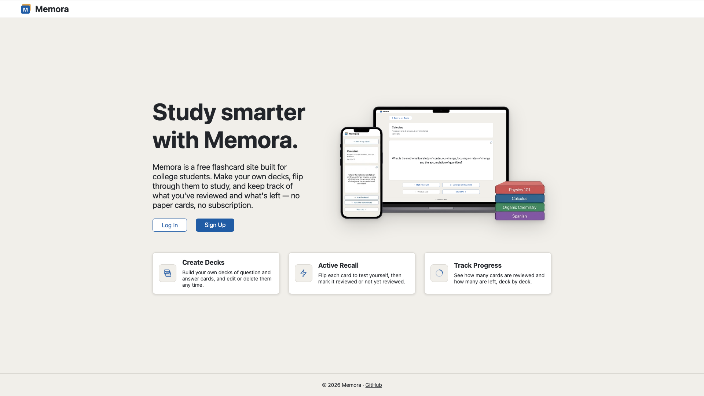
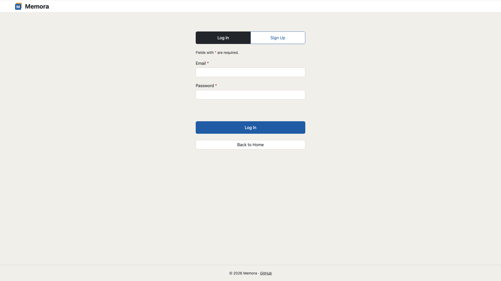
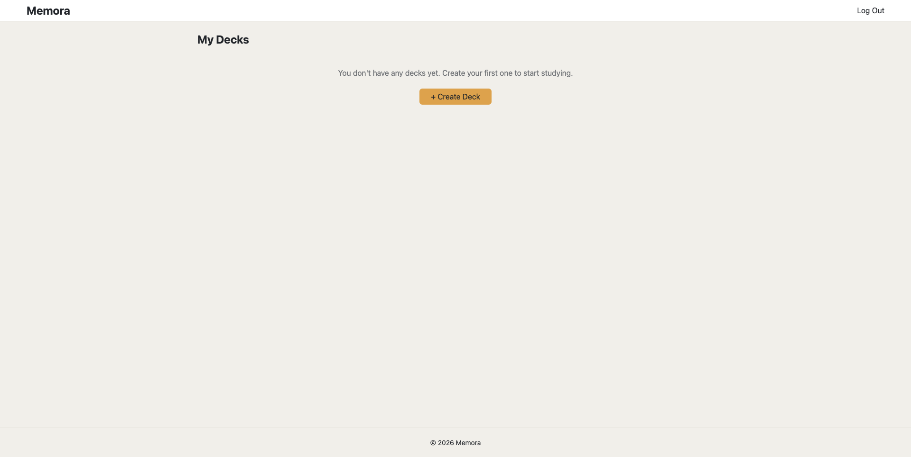
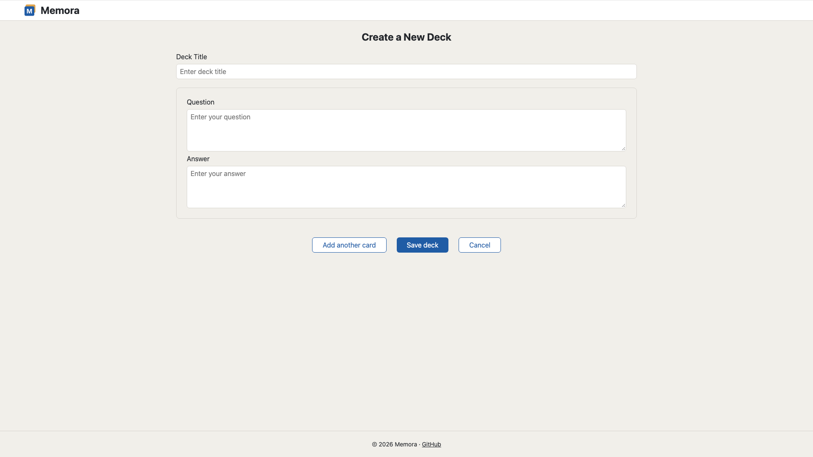
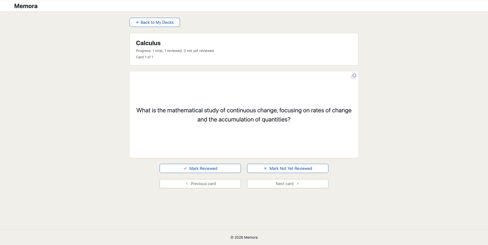

# Memora

[](AI-USAGE.md)

A free flashcard web app for college students.

## 1. Overview

Memora is a free flashcard web app for college students who want a faster way to review than paper cards. Students can create their own decks, study them with a flip-card interface, and see how many cards they still need to review, all without a paid subscription.

## 2. How to view it

**Live site:** https://joshphilippuangco.github.io/Memora/

**To run it locally:** clone the repository, then open `index.html` directly in a browser. No build step or local server is needed, since the site is plain HTML, CSS, and JavaScript.

```
git clone https://github.com/JoshPhilipPuangco/Memora.git
```

## 3. Pages and features

Memora has no backend. All data (the account, the logged-in user, and the decks) is saved in the browser's `localStorage`. The pages pass a deck to each other through the URL, for example `study-decks.html?deck=<id>`.

The usual flow is: Home, then Log In / Sign Up, then My Decks. From My Decks, a student can create a deck, edit a deck, delete a deck, or study a deck.

| Page                                 | What it does                                                                                                                                                                                                                                  | Navigation                                                                                                                                                                  | JavaScript                                                                                                                                                                                                                                                                                                                                                                                                       |
| ------------------------------------ | --------------------------------------------------------------------------------------------------------------------------------------------------------------------------------------------------------------------------------------------- | --------------------------------------------------------------------------------------------------------------------------------------------------------------------------- | ---------------------------------------------------------------------------------------------------------------------------------------------------------------------------------------------------------------------------------------------------------------------------------------------------------------------------------------------------------------------------------------------------------------- |
| **Home** (`index.html`)              | Intro to Memora with Log In / Sign Up buttons and a footer.                                                                                                                                                                                   | "Log In" opens Log In / Sign Up. "Sign Up" opens the same page on the Sign Up tab (`login.html#signup`).                                                                   | None.                                                                                                                                                                                                                                                                                                                                                                                                            |
| **Log In / Sign Up** (`login.html`)  | One page with a Log In tab and a Sign Up tab. Switching tabs shows the matching form.<br><br>Fields are checked before saving (username 6+ characters with only letters, numbers, and `_`; valid email format; password 6+ characters). Error messages show in a red line.<br><br>The Log In tab has email and password fields. The page checks them against the saved account and shows "Incorrect email or password" if they do not match.<br><br>A user who is already logged in is sent straight to My Decks instead of seeing the forms.                                                  | On success, the user is sent to My Decks. The logo or "Back to Home" link returns to Home.                                                                                  | `login.js` switches tabs, checks the fields, and saves the account and the current user to `localStorage`. Usernames and emails are trimmed of outer spaces, but passwords are kept exactly as typed.<br><br>If the URL ends with `#signup`, the Sign Up tab opens first.<br><br>It also checks for a logged-in user every time the page is shown, including when the browser's Back button restores it, and sends that user to My Decks. The page is hidden during the redirect so the form never flashes.<br><br>Only one account is supported per browser, by design. The password is saved as plain text, which is fine for a class project but not safe for a real app.                                                                              |
| **My Decks** (`my-decks.html`)       | Shows the student's decks as cards. Each card has a title link, a progress summary (total, reviewed, not yet reviewed), an "Edit" link, and a "Delete" button.<br><br>A "Search decks" box above the list filters the cards by title as the student types, ignoring upper and lower case. If nothing matches, the page says so and shows the typed text.<br><br>Delete opens a confirmation pop-up. If there are no decks, an empty message and a "+ Create Deck" button show instead (the search box is hidden).<br><br>Anyone who is not logged in is sent to Log In. | Clicking a deck title opens Study Mode for that deck. "Edit" opens that deck in Create Deck. "+ Create Deck" opens a blank Create Deck.<br><br>"Log Out" in the nav bar clears the logged-in user and goes to Home (only My Decks has this link).                                     | `my-decks.js` checks that a user is logged in (the page is hidden while a logged-out visitor is sent to Log In), removes the current user from `localStorage` when "Log Out" is clicked, then draws the decks from `localStorage`.<br><br>The page is rebuilt from the saved decks after every change, every keystroke in the search box, and every time the page is shown, including when the browser's Back button restores it. Only decks whose title contains the search text are drawn, so the filter also stays in place after a delete.<br><br>The delete pop-up closes on "Cancel", on a click outside the box, or on the `Escape` key. "Delete" removes the deck and redraws the page.                                                                                                                     |
| **Create Deck** (`create-deck.html`) | Lets a student name a new deck and add question/answer cards, with buttons to add or remove individual cards before saving. A deck must keep at least one card.<br><br>The same page works as the Edit Deck page.<br><br>Anyone who is not logged in is sent to Log In.                                     | "Cancel" returns to My Decks without saving. "Save deck" saves the deck and returns to My Decks. The logo also returns to My Decks.                                | `create-deck.js` checks that a user is logged in every time the page is shown, including when the browser's Back button restores it, and sends anyone else to Log In.<br><br>The page is hidden during the redirect so the form never flashes.<br><br>It adds and removes card fields, each with a unique ID. Every saved card also gets its own card ID, which editing keeps.<br><br>With no `?deck=` in the URL, it starts empty (Create mode). With `?deck=<id>`, it fills the form from `localStorage` and saves changes to that deck (Edit mode).<br><br>In Edit mode, the heading changes to "Edit Deck" and the button changes to "Save changes". Editing keeps each card's reviewed mark.<br><br>If the title, a question, or an answer is empty (or only spaces), a red message shows above the buttons, the empty field gets a red border, and nothing is saved.                                                              |
| **Study Mode** (`study-decks.html`)  | Shows one deck's cards one at a time: a title with a progress summary, a flip card that shows the question first and flips to the answer on click, and buttons to mark a card reviewed or not reviewed and move to the next or previous card.<br><br>Marking a card moves on to the next unmarked card and the marked button turns dark.<br><br>Once every card in the round has been marked, a pop-up asks what to do next: review only the not-yet-reviewed cards or reset the deck's progress (or, when every card is reviewed, just whether to reset). The same pop-up shows when a deck that already has progress is opened.<br><br>Anyone who is not logged in is sent to Log In. | "Back to My Decks" returns to My Decks. The logo also returns to My Decks.                                                                                                  | `study-decks.js` checks that a user is logged in every time the page is shown, including when the browser's Back button restores it, and sends anyone else to Log In. The page is hidden during the redirect, and the deck is only loaded for a logged-in user.<br><br>It reads the `?deck=<id>` from the URL and loads that deck from `localStorage`. It saves each card's reviewed mark and the last studied date back to the deck, matching each mark to the saved card with the same card ID, so edits made to the deck in another tab are kept and a mark never lands on the wrong card.<br><br>Decks saved before cards had IDs get them the first time they are studied.<br><br>If there is no deck ID, the deck is not found, or the deck has no cards, it shows a message instead of the flip card. The card can also be flipped with Enter or Space.<br><br>Studying runs in rounds: a list of card positions and a matching list of true/false marks. A round is finished when every mark is true.<br><br>The pop-up closes on its buttons, on a click outside the box, or on the `Escape` key. "Reset progress" sets every card back to not reviewed. "Review" starts a new round with only the not-yet-reviewed cards. |

## 4. Project structure

```
Memora/
├── index.html, login.html, create-deck.html, my-decks.html, study-decks.html
├── shared.css (site-wide styles) + one CSS file per page
├── login.js, create-deck.js, my-decks.js, study-decks.js (one JS file per interactive page)
├── assets/
│   ├── Home-Page-Image.png (hero image on the Home page)
│   └── screenshots/ (README screenshots)
└── .github/ (CODEOWNERS + GitHub Pages deploy workflow)
```

Each page loads `shared.css` plus its own page-specific CSS file.

## 5. Screenshots

| Page             | Screenshot                                                     |
| ---------------- | -------------------------------------------------------------- |
| Home             |                  |
| Log In / Sign Up |  |
| My Decks         |          |
| Create Deck      |    |
| Study Mode       |      |

## 6. Known issues and next steps

Found in a review of the live site against the Final Project rubric. Each issue is fixed in a separate pull request, grouped into sessions below.

| #   | Issue                                                                                                                                                                                                                          | Where                                              | Severity   |
| --- | ------------------------------------------------------------------------------------------------------------------------------------------------------------------------------------------------------------------------------ | -------------------------------------------------- | ---------- |
| 5   | `create-deck.html` does not follow the `index.html` reference style: different indentation, trailing whitespace on 6 lines, a typo in a comment ("buttonss"), and no `/>` on void tags like the other four pages.              | `create-deck.html`                                 | Low        |
| 8   | The Study Mode message says "press Study on a deck", but there is no Study button. The deck title is the link.                                                                                                                 | `study-decks.js`                                   | Low        |
| 9   | Cancel uses `history.back()`, so in a fresh tab it sends the user to a blank page instead of My Decks. Passwords are trimmed, which silently removes leading and trailing spaces. My Decks does not hide the page while it redirects a logged-out visitor, unlike the other pages. | `create-deck.js`, `login.js`, `my-decks.js`        | Low        |
| 10  | The proposal lists sample decks (at least two subjects) and sample user info for a demo. Neither exists, so a first-time visitor sees an empty My Decks, and the README has no demo walkthrough.                                | README, site content                               | Medium     |
| 11  | The proposal lists a logo, but the nav bar shows the plain text "Memora". The footer is only "&copy; 2026 Memora". The site also has no favicon, so every page load requests `/favicon.ico` and gets a 404.                    | all pages, `assets/`                               | Low        |
| 12  | Duplicated code across the JavaScript files: `isLoggedIn()` is the same in 4 files, `loadDecks()` is in 3, and the card ID format is repeated in `create-deck.js` and `study-decks.js` with a note to "keep in sync by hand". | `login.js`, `my-decks.js`, `create-deck.js`, `study-decks.js` | Medium     |
| 13  | Inconsistent code style: `study-decks.js` uses a function wrapper the other files do not, `create-deck.js` uses 4-space double quotes while the others use 2-space single quotes, `'use strict'` is in only 3 of 4 JS files, and some comments have typos ("AdD", "CaNCEL", "SuBMIT", "ReMOVE"). `shared.css` also has unused rules (`.heading`, `.text-small`, `.footer a`), which are left alone unless a change to `shared.css` is approved. | JS files, `create-deck.css`, `shared.css`          | Low        |
| 14  | There is no `.gitignore`, so `.DS_Store` files could be committed by accident. The project structure section above leaves out `AI-USAGE.md`, the compiled increment reports, and `.nojekyll`.                                    | repo root, README                                  | Low        |

### Fix sessions

Each session is one branch and one pull request. Some sessions edit the same files, so merge them in this order: 3, 4, 5, 6, 7 (sessions 1 and 2 are done and merged). Session 7 touches no files the others edit, so it can go at any time.

| Session | Issues  | Theme                                | Files                                                                          |
| ------- | ------- | ------------------------------------ | ------------------------------------------------------------------------------ |
| 3       | 8, 9    | Small behavior and wording fixes (JS) | `study-decks.js`, `create-deck.js`, `login.js`, `my-decks.js`                  |
| 4       | 10, 11  | Demo content and branding            | README, `assets/`, nav bar and footer in all pages                              |
| 5       | 12      | Move the shared JavaScript into one file | new shared JS file, all four JS files, all four HTML pages that load them   |
| 6       | 5, 13   | Formatting and style consistency     | `create-deck.html`, all JS files, `create-deck.css`                             |
| 7       | 14      | Repo hygiene                         | `.gitignore`, README project structure                                          |

Notes: Sessions 3, 5 and 6 all edit the JavaScript files, and sessions 4 and 6 both edit the HTML pages. Start each one only after the one before it is merged, so none of them has merge conflicts.

## AI use

Most of Memora's code was written with AI assistance, using Claude Code, Claude (web chat), and ChatGPT. The team reviewed, tested, and changed that code by hand.

See [AI-USAGE.md](AI-USAGE.md) for the full account: how we used AI, where it got things wrong, and who wrote what.
